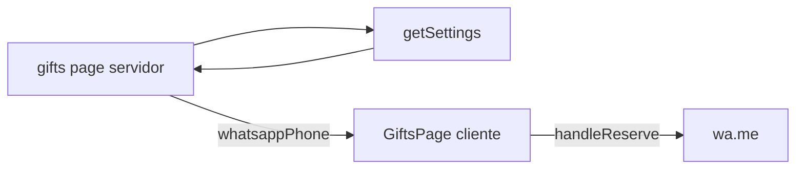

# Plano: lista de presentes (UI, JSON, WhatsApp, tipos)

Documento para execução (Next.js, App Router). **Não editar este ficheiro como parte da implementação** — usar apenas como especificação.

## Checklist de entregas (todos)

1. **gift-type-schema** — `offeringType` / `offering_type`, defaults na UI, POST/PUT, GiftCard, mensagem WhatsApp.
2. **image-consolidation** — `imageUrl` vs `referenceImageUrl` + `image_url` no JSON; GiftCard e GiftsManager; `next.config.js` `remotePatterns` se necessário.
3. **settings-whatsapp** — `gifts_whatsapp` em Settings (default `551998949240`), admin, prop em `gifts/page.tsx`; opcional redirect `/whatsapp` ou route `/wa` → `wa.me`.
4. **card-ui-polish** — GiftCard (aspect ratio, `sizes`, título/descrição, botões) + skeleton GiftGrid.
5. **optional-filter** — Filtro por `offeringType` em GiftFilters + GiftsPage.
6. **optional-pix-qr** — Bloco PIX (settings + QR/copia-e-cola) na página de presentes.
7. **optional-donation-page** — Rota `/doar` (ou similar): copy UX, PIX, voltar à lista, metadata, reutilizar `pix_*` em settings.

---

## Convenção: onde recuperar textos e JSON

- **Fonte única** para textos e dados lidos pela app: `src/lib/data/` (caminho absoluto no repo: `/src/lib/data`).
- Já nesse padrão: `src/lib/data/settings.json` via `src/lib/data/settings.ts`.
- **Presentes:** alinhar `gifts.json` em **`src/lib/data/gifts.json`** (hoje pode estar em `data/gifts.json` na raiz). Ajustar `src/lib/data/gifts.ts` e `.gitignore` conforme política (versionar ou ignorar `gifts.json`).

### Estrutura de pastas (tree)

**Dados em `src/lib/data`:**

```text
src/lib/data/
├── gifts.ts              # getGifts / saveGifts → gifts.json
├── gifts.json
├── manual-padrinhos.ts
├── manual-padrinhos.json
├── settings.ts
└── settings.json         # evento + gifts_whatsapp, pix_*, etc.
```

**App / lista de presentes:**

```text
src/
├── app/
│   ├── (public)/gifts/page.tsx
│   ├── (public)/doar/page.tsx   # opcional
│   └── api/gifts/
│       ├── route.ts
│       └── [id]/route.ts
└── lib/
    ├── components/gifts/
    ├── components/settings/    # GiftsManager
    ├── data/
    ├── pages/gifts/
    ├── types/gift.ts
    └── utils/                  # ex.: whatsapp.ts
```

---

## Contexto do código atual

- Pública: `src/app/(public)/gifts/page.tsx` + cliente `src/lib/pages/gifts/GiftsPage.tsx`. “Presentear” abre WhatsApp; não há API de reserva no fluxo atual (`handleReserve` em GiftsPage).
- Tipo: `src/lib/types/gift.ts`; persistência via `src/lib/data/gifts.ts`.
- Card: `src/lib/components/gifts/gift-card/GiftCard.tsx` — hoje imagem pode priorizar `referenceImageUrl` sobre `imageUrl`; alinhar com plano.
- `next.config.js` — `images.remotePatterns` (ex.: Unsplash, Amazon); outras origens falham com `next/image`.
- Settings: `src/lib/types/settings.ts` + `src/lib/data/settings.ts`.

---

## 1. Modelo JSON (`Gift`)

- **`offering_type`** no JSON: `unique` | `repeatable`. Na UI: “Um só” vs “Vários podem presentear”. Pode manter tipo TS `Gift` com `offeringType` (camelCase) e converter em `gifts.ts`.
- **Compatibilidade:** sem `offering_type` ⇒ tratar como `repeatable`. JSON antigo em camelCase: normalizar em `getGifts` ou migrar ficheiro.
- **Convenção:** chaves nos JSON em **`snake_case`** no disco; API/admin pode enviar camelCase e converter na camada de persistência.
- **Imagens:** canónico `image_url`; legado `reference_image_url` → fallback `image_url ?? reference_image_url`.
- **GiftsManager:** um campo “URL da foto (card)” que grava `image_url` (e migração se só existir legado).
- **POST** `src/app/api/gifts/route.ts` e **PUT** `src/app/api/gifts/[id]/route.ts`: gravar snake_case; default `offering_type` no POST se omitido.

### Exemplo `src/lib/data/gifts.json`

```json
[
  {
    "id": "1730000000001",
    "name": "Panela de pressão elétrica",
    "description": "Capacidade 5L, marca de preferência livre.",
    "category": "cozinha",
    "offering_type": "unique",
    "price": 449.9,
    "price_range": "alto",
    "image_url": "https://images.unsplash.com/photo-xxx",
    "reference_image_url": null,
    "store_url": "https://www.exemplo-loja.com/produto",
    "store_name": "Magazine Exemplo",
    "reference_url": "https://www.exemplo.com/sugestao-produto",
    "status": "available",
    "priority": 10,
    "created_at": "2025-01-15T12:00:00.000Z",
    "updated_at": "2025-01-15T12:00:00.000Z"
  }
]
```

- `category`: `casa` | `cozinha` | `decoracao` | `eletrodomesticos` | `quarto` | `banheiro` | `outros`
- `status`: `available` | `reserved` | `purchased`
- `price_range`: `baixo` | `medio` | `alto`
- `reserved_by` (opcional): `{ "guest_id", "guest_name", "reserved_at" }`

### Exemplo `src/lib/data/settings.json` (campos relevantes)

```json
{
  "wedding_date": "2026-06-14T16:00:00.000Z",
  "ceremony_location": "…",
  "reception_location": "…",
  "couple_names": { "person_1": "…", "person_2": "…" },
  "gifts_whatsapp": "551998949240",
  "pix_copy_paste": "00020126580014br.gov.bcb.pix…",
  "pix_qr_image_path": "/images/pix-qrcode.png",
  "pix_qr_image_url": null,
  "pix_note": "Nome no PIX: …"
}
```

- `gifts_whatsapp`: só dígitos (E.164 sem `+`).
- `pix_*`: opcionais; mostrar bloco PIX se houver **QR (path ou URL) ou** copia-e-cola.
- Legado `couple_names.person1` / `person2`: normalizar em `getSettings` se necessário.

---

## 2. WhatsApp

### Número e redirecionamento

- Referência: `(19) 99894-9240` → `wa.me`: **`551998949240`**.
- **defaultSettings:** `gifts_whatsapp: "551998949240"`.
- Fluxos “Presentear” → `https://wa.me/<digits>?text=<encoded>`.
- Opcional: rota `GET` `/wa` ou `/whatsapp` com redirect 302 para `wa.me`.

### Implementação

- `Settings` + `getSettings` / `saveSettings` / `defaultSettings` em `src/lib/data/settings.ts`.
- Admin: `EventInfoTab` ou bloco junto a presentes; `SettingsPageClient` + `handleSaveSettings`.
- `gifts/page.tsx`: `getSettings()` no servidor → prop `whatsappPhone` para `GiftsPage`.
- Util: `src/lib/utils/whatsapp.ts` — só dígitos, montar URL.
- Sem número: desabilitar “Presentear” ou mensagem clara.

### PIX na página de presentes (opcional)

- Secção “Prefere enviar um PIX?”: QR + copia-e-cola + Copiar.
- Mesmos campos `pix_*` em settings; não renderizar se vazio.
- Admin: textarea + URL/path imagem.

### Tela `/doar` (opcional)

- Copy: presente de casamento, não “doação” institucional.
- Reutilizar `pix_*`; metadata própria; link “Ver lista de presentes” → `/gifts`.
- Sem formulário de dados pessoais obrigatório.
- Opcional: chips “Sugestões R$ 50 / 100 / 200” (só texto).

---

## 3. UI do card

Ficheiros: `GiftCard.tsx`, `styles.ts`, `GiftGrid.tsx`.

- Imagem: `aspect-[4/3]`, `fill`, `object-cover`, `sizes`.
- Título / descrição: hierarquia clara, `line-clamp-3` na descrição.
- Badges: categoria, status, chip **Um só** / **Vários podem presentear**.
- Botões: **Presentear** (primário); **Ver sugestão** (`outline`, se `referenceUrl`); desktop `flex-row` opcional, mobile `flex-col`, `min-h` tocável.

### Wireframe (referência)

```text
┌──────────────────────────────────────┐
│  [Cozinha]              [Disponível] │
│           FOTO (4:3)                  │
├──────────────────────────────────────┤
│  Título                               │
│  Descrição…                           │
│  R$ …                                 │
│  [ Um só ]                            │
│  [ Presentear ]                       │
│  [ Ver sugestão ]                     │
└──────────────────────────────────────┘
```

- Indisponível: esconder “Presentear”; opcional `opacity` no card.

---

## 4. Mensagem WhatsApp (`handleReserve`)

- Nome, preço/faixa.
- Se `unique`: texto pedindo confirmação de reserva do item único; se `repeatable`: texto adequado.
- Emoji opcional / tom formal conforme preferência.

---

## 5. Filtros (opcional)

- GiftFilters + GiftsPage: filtro por `offeringType` (Todos / Um só / Vários podem presentear).

---

## Diagrama (WhatsApp)



---

## Ordem sugerida de implementação

1. Caminho `gifts.json` → `src/lib/data/` + `gifts.ts` + `.gitignore`.
2. Tipo `Gift` + serialização snake_case + GiftCard (imagem, badges, botão Ver sugestão).
3. Settings `gifts_whatsapp` + admin + `gifts/page.tsx` + util WhatsApp + `handleReserve`.
4. GiftsManager (foto, `offering_type`).
5. `next.config.js` + filtros opcionais.
6. Bloco PIX na lista (opcional).
7. Página `/doar` (opcional).

---

## Riscos / decisões

- **Reserva:** `reserved`/`purchased` não são atualizados pelo WhatsApp hoje; `unique` é sobretudo UX/comunicação até haver backend ou processo manual.
- **Imagens:** domínios não permitidos em `remotePatterns` quebram `next/image` — alargar lista ou usar `public/images/`.
- **Deploy:** JSON local pode não persistir em ambientes sem filesystem (ex.: Vercel serverless) — equacionar se o admin grava ficheiros em produção.

---

## Extras recomendados (não obrigatórios no plano original)

- Migração documentada de `data/gifts.json` antigo → `src/lib/data/gifts.json`.
- `metadata` em `/gifts` e `/doar` para SEO/partilha.
- Acessibilidade: `alt` nas fotos, `aria-live` no “Copiar” PIX.
